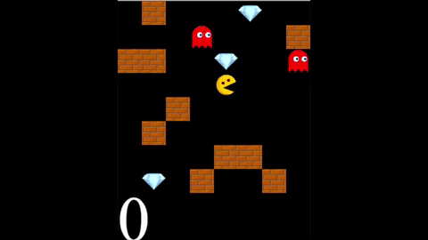

# MiniPacmanDQN
Deep Reinforcement Learning with Pacman

## Demo

## Requirements

- `python==3.5.1`
- `tensorflow==2.0.0`
- `Keras==2.3.0`
- `numpy==1.17.2`

## Related work

- [Stanford's Multi-Agent Pac-Man](https://stanford.edu/~cpiech/cs221/homework/prog/pacman/pacman.html)
- [UC Berkeley CS188 Intro to AI Pac-Man Projects](http://ai.berkeley.edu/project_overview.html)
- [tychovdo's github](https://github.com/tychovdo/PacmanDQN)
